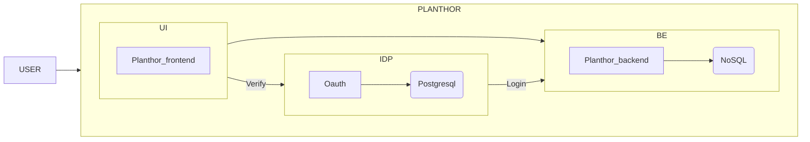
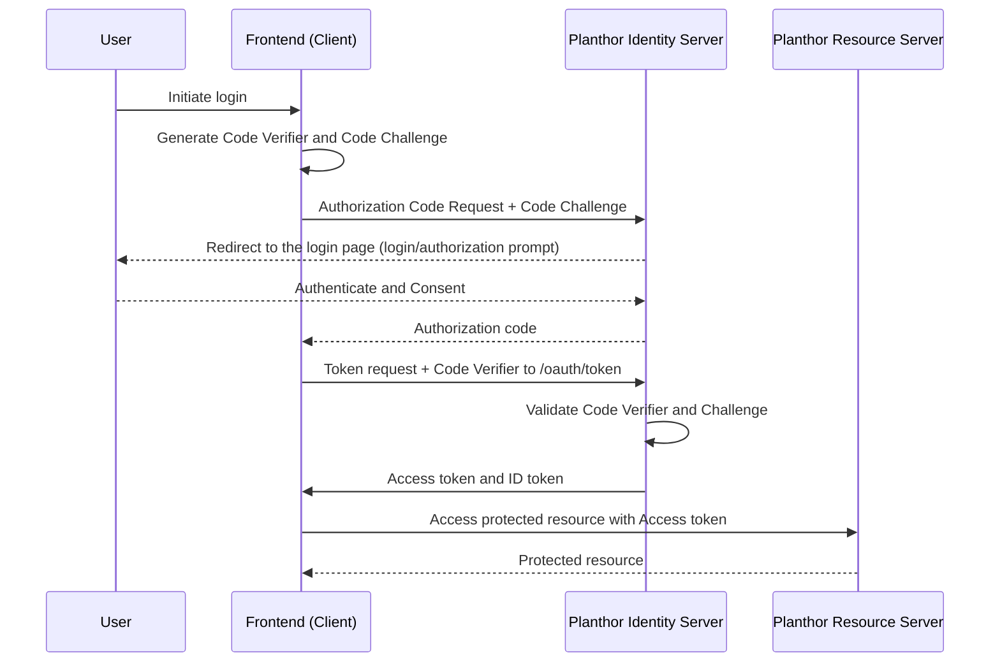

# Planthor flow and Infrastructure flow

## Gitflow
CI/CD Pipeline.
Reffer: [link]('https://creately.com/diagram/example/c5JMedWsSpq/ci/cd-pipeline-example')

 
## Microservice deployment architecture
Reffer: [link]('https://techdozo.dev/deploying-a-restful-spring-boot-microservice-on-kubernetes/')

## USER flowchart

## Authorization Code Flow with Proof Key for Code Exchange (PKCE)

