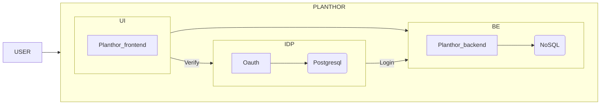
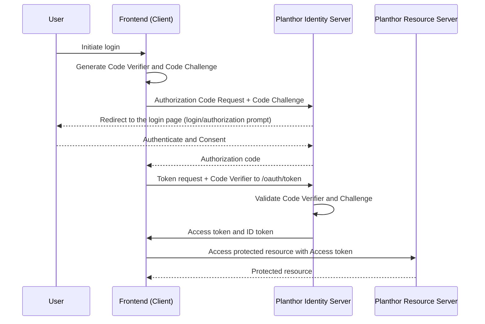

# Planthor Documentation

> Official documentation site for the **Planthor** project and the **Dragging to Dream (D2D)** community.

[](https://github.com/Planthor/planthor-documentation/actions/workflows/deploy.yml)

📖 **Live site:** [https://planthor.github.io/planthor-documentation/](https://planthor.github.io/planthor-documentation/)

---

## Overview

Planthor is an open-source goal and objectives tracking application built to support the _"Dragging to Dream"_ (D2D) community. This repository hosts the centralized documentation site — covering architecture, tech stack, use cases, DevOps practices, and more.

The site is built with [Docusaurus 3](https://docusaurus.io/) and supports both **English** and **Vietnamese (Tiếng Việt)** locales.

---

## Prerequisites

| Tool | Version |
| ---- | ------- |
| Node.js | ≥ 20.0 |
| npm | bundled with Node.js |

---

## Getting Started

```bash
# 1. Clone the repository
git clone https://github.com/Planthor/planthor-documentation.git
cd planthor-documentation

# 2. Install dependencies
npm install

# 3. Start the local dev server (English)
npm start

# 4. Start the local dev server (Vietnamese)
npm start -- --locale vi
```

The development server starts at `http://localhost:3000/planthor-documentation/`.

---

## Available Scripts

| Script | Description |
| ------ | ----------- |
| `npm start` | Start local development server |
| `npm run build` | Generate a production build into `build/` |
| `npm run serve` | Serve the production build locally |
| `npm run typecheck` | Run TypeScript type-checking |
| `npm run fix-puml` | Wrap any raw `@startuml` blocks in `pumld` code fences |
| `npm run clear` | Clear the Docusaurus build and cache |
| `npm run write-translations` | Extract translatable strings |

---

## Project Structure

```
planthor-documentation/
├── docs/                   # English documentation (Markdown)
├── i18n/vi/                # Vietnamese translations and localized pages
├── src/
│   ├── components/         # Reusable React components
│   ├── css/custom.css      # Global "Industrial Minimalist" theme
│   └── pages/              # Custom pages (homepage, about)
├── static/                 # Static assets (images, manifest.json)
├── scripts/fix-puml.js     # PlantUML auto-wrap utility
├── docusaurus.config.ts    # Main Docusaurus configuration
├── sidebars.ts             # Sidebar structure
└── .github/workflows/      # GitHub Actions CI/CD
```

---

## Documentation Content

| Page | Description |
| ---- | ----------- |
| Introduction | Project vision and 2026 program guidance |
| Features | Mindmap of application features |
| Program Management | Triple Constraint and organization structure |
| Tech Stack | Flutter front-end, .NET 10 back-end overview |
| C4 Architecture | Context → Container → Component diagrams (PlantUML) |
| ERD | Entity Relational Diagram (Mermaid) |
| Use Case Diagram | PlantUML use case diagram |
| Use Cases | Detailed use case specifications (auth, Strava, logout) |
| Original Design | UI Kit and phased roadmap |
| DevOps | CI/CD pipeline and infrastructure (Mermaid) |
| Git Strategy | Branching & release strategy (Mermaid) |

---

## Diagrams

- **Mermaid** diagrams are rendered natively via `@docusaurus/theme-mermaid`.
- **PlantUML** diagrams use `docusaurus-theme-plantuml` with the `pumld` code fence tag.

If you paste a raw `@startuml` block, run the helper to auto-wrap it:

```bash
npm run fix-puml
```

---

## Internationalization (i18n)

The site ships with two locales:

| Locale | Label | Path |
| ------ | ----- | ---- |
| `en` | English | `/planthor-documentation/` |
| `vi` | Tiếng Việt | `/planthor-documentation/vi/` |

To contribute Vietnamese translations, edit the files under `i18n/vi/`.

---

## CI/CD & Deployment

GitHub Actions automatically builds and deploys the site to **GitHub Pages** on every push to `main`. Pull requests also trigger a build-only check.

Workflow file: [.github/workflows/deploy.yml](.github/workflows/deploy.yml)

| Trigger | Behavior |
| ------- | -------- |
| `push` to `main` | Build + Deploy to GitHub Pages |
| `pull_request` to `main` | Build only (no deploy) |
| `workflow_dispatch` | Manual build + deploy |

---

## Contributing

1. Fork the repository.
2. Create a feature branch: `git checkout -b feat/your-change`.
3. Make your changes and verify the build: `npm run build`.
4. Open a pull request against `main`.

Please follow the documentation standards in [GEMINI.md](GEMINI.md).

---

## Design

The site uses an **"Industrial Minimalist"** theme:

- **Primary color:** Navy Blue `#003366`
- **Accent color:** Bright Blue `#3399ff`
- **Typography:** Uppercase headings, weight 800+, zero border-radius
- **Logo:** `static/img/planthor-logo.png`

---

## License

This project is open-source. See the repository for license details.

---

## Archived Notes

<details>
<summary>Legacy Gitflow &amp; Architecture diagrams</summary>

## Gitflow
CI/CD Pipeline.
Reffer: [link]('https://creately.com/diagram/example/c5JMedWsSpq/ci/cd-pipeline-example')

 
## Microservice deployment architecture
Reffer: [link]('https://techdozo.dev/deploying-a-restful-spring-boot-microservice-on-kubernetes/')


## USER flowchart

```mermaid
flowchart LR
  direction LR
  subgraph PLANTHOR
    subgraph UI
        Planthor_frontend
    end
    subgraph IDP
        direction LR
        Oauth --> user_db(Postgresql)
    end
    UI -- Verify --> IDP
    subgraph BE
      direction LR 
      Planthor_backend --> planthor_be_db(NoSQL)
    end
    direction LR
    UI --> BE
    IDP -- Login --> BE
  end
  
  USER --> PLANTHOR 
  
```

## Authorization Code Flow with Proof Key for Code Exchange (PKCE)

```mermaid
sequenceDiagram
    User->>Frontend (Client): Initiate login
    Frontend (Client)->>Frontend (Client): Generate Code Verifier and Code Challenge
    Frontend (Client)->>Planthor Identity Server: Authorization Code Request + Code Challenge
    Planthor Identity Server-->>User: Redirect to the login page (login/authorization prompt)
    User-->>Planthor Identity Server: Authenticate and Consent
    Planthor Identity Server-->>Frontend (Client): Authorization code
    Frontend (Client)->>Planthor Identity Server: Token request + Code Verifier to /oauth/token
    Planthor Identity Server->>Planthor Identity Server: Validate Code Verifier and Challenge
    Planthor Identity Server->>Frontend (Client): Access token and ID token
    Frontend (Client)->>Planthor Resource Server: Access protected resource with Access token
    Planthor Resource Server-->>Frontend (Client): Protected resource
```

</details>
