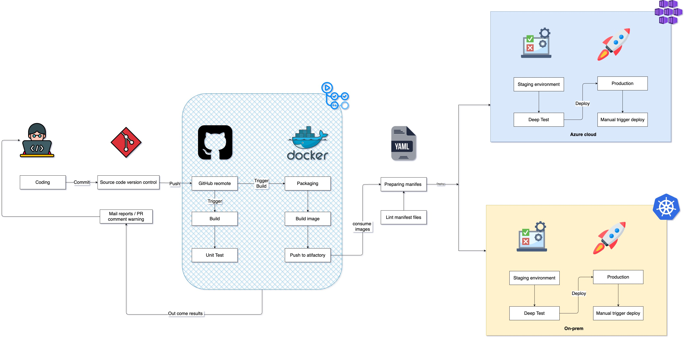
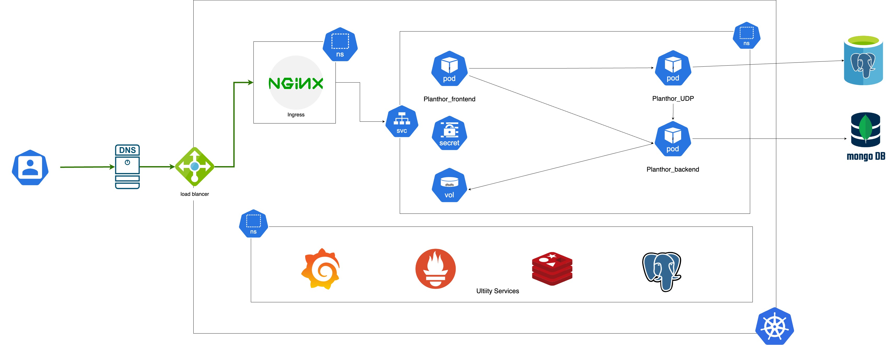
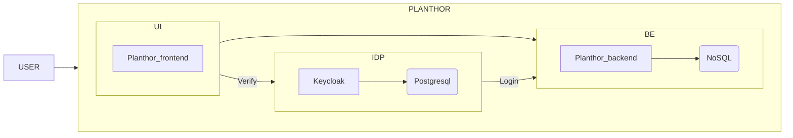
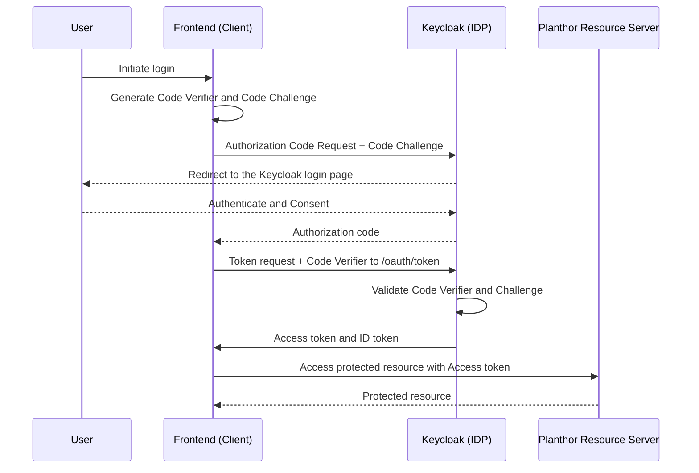

# Planthor flow and Infrastructure flow

## Gitflow
CI/CD Pipeline.
Reffer: [link]('https://creately.com/diagram/example/c5JMedWsSpq/ci/cd-pipeline-example')

 
## Microservice deployment architecture
Reffer: [link]('https://techdozo.dev/deploying-a-restful-spring-boot-microservice-on-kubernetes/')

## USER flowchart

```mermaid
flowchart LR
  direction LR
  subgraph PLANTHOR
    subgraph UI
        Planthor_frontend
    end
    subgraph IDP
        direction LR
        Keycloak --> user_db(Postgresql)
    end
    UI -- Verify --> IDP
    subgraph BE
      direction LR 
      Planthor_backend --> planthor_be_db(NoSQL)
    end
    direction LR
    UI --> BE
    IDP -- Login --> BE
  end
  
  USER --> PLANTHOR 
  
```

## Authorization Code Flow with Proof Key for Code Exchange (PKCE)

```mermaid
sequenceDiagram
    User->>Frontend (Client): Initiate login
    Frontend (Client)->>Frontend (Client): Generate Code Verifier and Code Challenge
    Frontend (Client)->>Keycloak (IDP): Authorization Code Request + Code Challenge
    Keycloak (IDP)-->>User: Redirect to the Keycloak login page
    User-->>Keycloak (IDP): Authenticate and Consent
    Keycloak (IDP)-->>Frontend (Client): Authorization code
    Frontend (Client)->>Keycloak (IDP): Token request + Code Verifier to /oauth/token
    Keycloak (IDP)->>Keycloak (IDP): Validate Code Verifier and Challenge
    Keycloak (IDP)->>Frontend (Client): Access token and ID token
    Frontend (Client)->>Planthor Resource Server: Access protected resource with Access token
    Planthor Resource Server-->>Frontend (Client): Protected resource
```

## Keycloak IDP
[Keycloak](https://www.keycloak.org/) is an open-source Identity and Access Management (IAM) solution used as the Planthor IDP. It replaces the previous open-library OAuth implementation, providing a production-ready, feature-rich identity layer.

**Key features used in Planthor:**
- OAuth 2.0 and OpenID Connect (OIDC) support
- Authorization Code Flow with PKCE for secure frontend authentication
- User federation backed by PostgreSQL
- Role-based access control (RBAC) for API resource protection
- Built-in admin console for user and client management

**Keycloak realm configuration:**
- Realm: `planthor`
- Client: `planthor-frontend` (public client, PKCE enabled)
- Client: `planthor-backend` (confidential client, for service-to-service calls)
- User storage: PostgreSQL (`user_db`)

Refer to the [Keycloak documentation](https://www.keycloak.org/documentation) for setup and configuration details.
