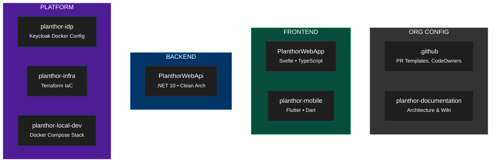
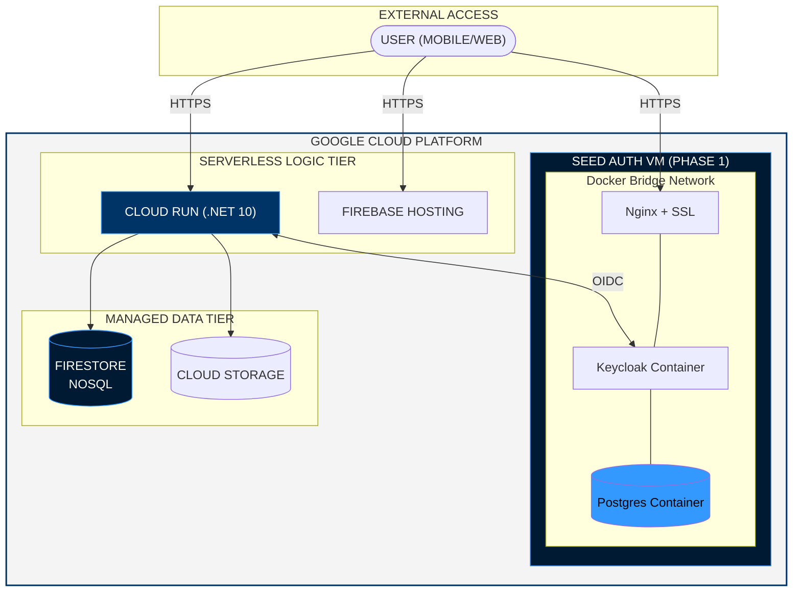
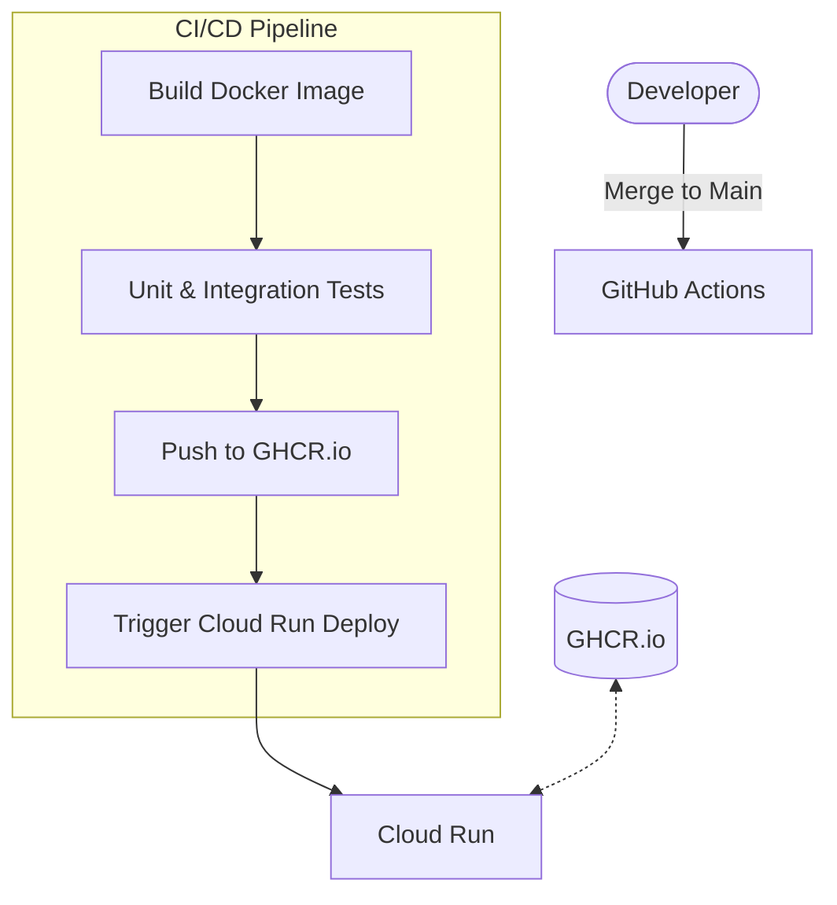
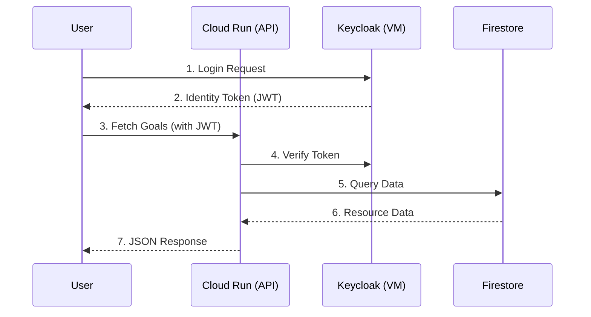

## 1. Organization Structure (The Planthor Monorepo)

Planthor follows a multi-repo strategy organized into functional domains. The "Central Wiki" (this documentation) acts as the source of truth for all architectural decisions.



---

## 2. Production Infrastructure (Scaling Phases)

To balance cost and stability, Planthor follows a multi-phase scaling strategy. We start with the **Seed Phase** to achieve a $14/mo production environment.

### Phase 1: Seed Phase (Current)
*   **Compute:** Single `e2-small` VM (2GB RAM) running **Docker Compose**.
*   **Auth Stack:** Keycloak + Postgres + Nginx (all in Docker).
*   **Logic Stack:** **Cloud Run** (.NET 10) scaling to zero.
*   **Data Stack:** **Firestore** (Serverless NoSQL).

### Phase 2: Growth Phase (Future)
*   **Database:** Migrate to **Cloud SQL (PostgreSQL)** for managed backups.
*   **Cache:** Introduce **Cloud Memorystore (Redis)** for session performance.

---

## 3. Infrastructure Diagram (Seed Phase)



---

## 4. Monthly Cost Estimate

| PHASE | COMPONENTS | MONTHLY COST |
| :--- | :--- | :--- |
| **PHASE 1 (Seed)** | `e2-small` VM + Cloud Run + Firestore | **~$14.00** |
| **PHASE 2 (Growth)** | VM + Cloud SQL + Cloud Run | **~$25.00** |
| **PHASE 3 (Scale)** | HA Cluster + Load Balancer + WAF | **$60.00+** |

---

## 5. Docker Optimization (e2-small)

Because the `e2-small` VM only has **2GB of RAM**, Docker containers must be strictly constrained.

### Resource Limits
In `docker-compose.yml`, always define limits to prevent a single container from crashing the VM:
```yaml
services:
  keycloak:
    deploy:
      resources:
        limits:
          memory: 1200M
        reservations:
          memory: 800M
  postgres:
    deploy:
      resources:
        limits:
          memory: 400M
```

### Logging Optimization
To prevent disk saturation on the small VM, use the `json-file` driver with rotation:
```yaml
logging:
  driver: "json-file"
  options:
    max-size: "10m"
    max-file: "3"
```

---

## 6. CI/CD & Deployment Flow



---

## 7. Monitoring & Health

1.  **Liveness Check:** `https://auth.planthor.com/health/live` (Monitored by UptimeRobot).
2.  **Resource Check:** SSH to VM and run `docker stats` weekly.
3.  **Logs:** **GCP Ops Agent** installed on VM to stream logs to Cloud Logging.

---

## 8. Request Flow (End-to-End)


