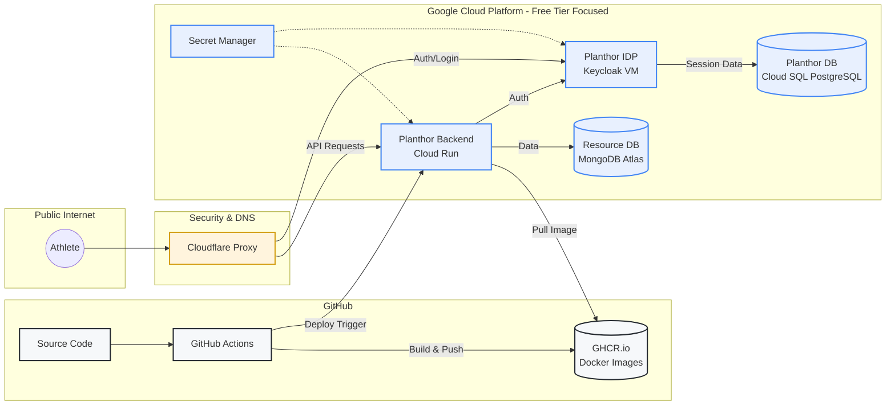
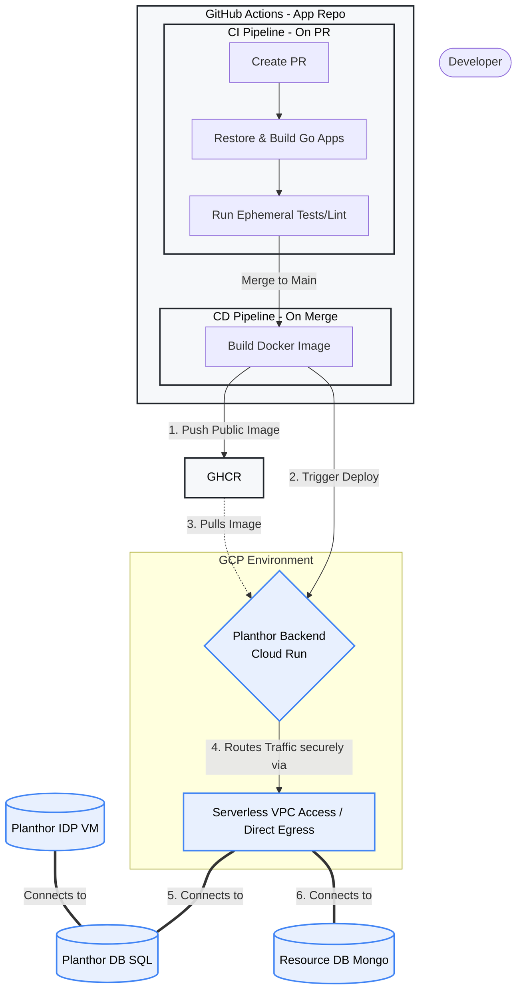
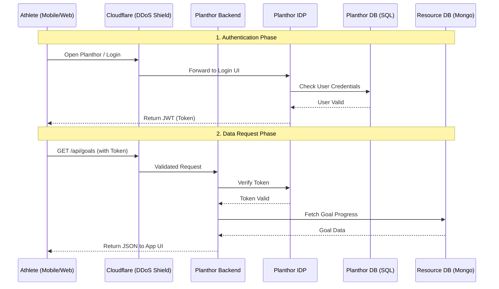

# Infrastructure Consideration (Dirty Cheap and Best Practices)

To optimize developer velocity while maintaining near-zero infrastructure costs during the development and sandbox phases of Planthor, the architecture heavily leverages serverless components and Google Cloud's Free Tier limits.

### 1. Compute & Application Hosting
* **Backend APIs:** Hosted on **Google Cloud Run**.
  * **Services:** `resourceAPI`, `githubAdapter`, `stravaAdapter`.
  * **Why:** Cloud Run natively handles intermittent webhook spikes and scales to zero. Staying within the 2 million requests/month free tier keeps API hosting costs at $0.
* **Identity Provider (Keycloak):** Hosted on **Google Compute Engine**.
  * **Specification:** 1x `e2-micro` Virtual Machine deployed in a free-tier eligible region (`us-central1`, `us-east1`, or `us-west1`).
  * **Why:** Keycloak is a heavy Java application that requires stateful sessions and suffers from severe cold-start latency on serverless containers. Running it on a free-tier VM avoids these issues while keeping compute costs at $0.

### 2. Database
* **Identity & Session Data:** **Google Cloud SQL for PostgreSQL**.
  * **Tier:** `db-f1-micro` (Shared vCPU, 0.6 GB RAM) with ~10 GB Zonal SSD.
  * **Configuration:** Single-zone (No High Availability/Failover) to prevent doubling costs.
* **Application Resources:** **MongoDB Atlas** (Free Tier).
  * **Specification:** M0 Sandbox (Shared RAM, 512 MB to 5 GB storage).
  * **Why:** Provides a managed NoSQL database for flexible goal/resource schemas at $0 cost.
* **Cost Optimization Strategy:** A Cloud Scheduler cron job can be implemented to automatically stop the Cloud SQL database during off-hours to save compute costs.

### 3. Container Storage & CI/CD
* **Registry:** **GitHub Container Registry (GHCR)**.
  * **Why:** Replaces Google Artifact Registry. By keeping the Docker images public for this open-source project, storage and bandwidth costs drop to $0. Cloud Run pulls the compiled images directly from GHCR.

### 4. Networking & Security
* **DNS Proxy & DDoS Protection:** **Cloudflare** (Free Tier).
  * **Routing:** The custom domain is routed through Cloudflare's nameservers.
  * **Keycloak Entry:** Proxied to the static external IP of the Compute Engine VM to provide enterprise-grade DDoS protection and prevent brute-force attacks on the micro-VM.
* **VPC Firewall Lockdown:**
  * **Rule 1 (Web Traffic):** All public internet traffic to the Keycloak VM on ports 80 and 443 is denied. Ingress is explicitly allowed *only* from Cloudflare's published IPv4 ranges using a network tag (`keycloak-server`).
  * **Rule 2 (SSH Access):** Public SSH (`tcp:22` from `0.0.0.0/0`) is denied. SSH ingress is strictly limited to Google's Identity-Aware Proxy (IAP) IP range (`35.235.240.0/20`).
* **Credentials Management:** **Google Secret Manager** securely injects database passwords, GitHub/Strava API keys, and Keycloak admin credentials into Cloud Run and the VM at runtime.

## 5. Organization Structure 

## 6. CI/CD & Deployment Flow 

## 8. Request Flow

