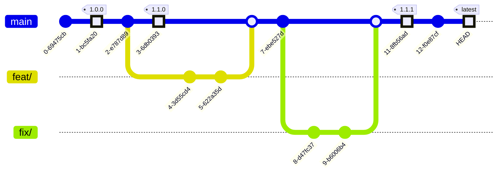

# Diagram

## Tentative release plan

Ideally:

- `major` = yearly
- `minor` = quarterly
- `patch` = monthly/critical
- `main` = latest

## Disclaimer

We will not maintain the older versions of "major", "minor".
