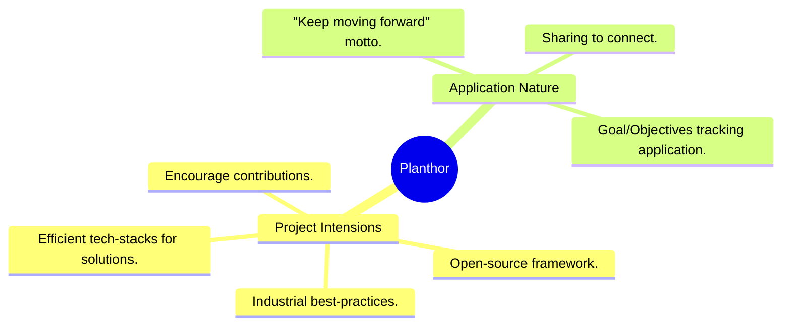
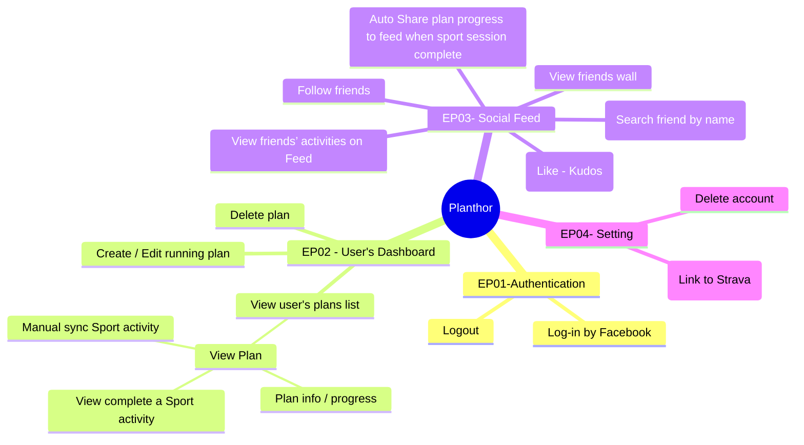

# Introduction

Welcome to the Planthor documentation! Here you can find almost all the information you need when interacting with the Planthor project.

## Project purposes

Planthor is an open-source goal/objectives tracking application designed to support the journey of the "Dragging to Dream" (D2D) community. By providing a platform to track progresses and share achievements, Planthor fosters a "keep moving forward" mentality and encourages contributions to the framework itself. This fosters a collaborative environment where D2D members can connect, learn from each other, and continuously develop their skills.

## Program Guidance 2026

We are no longer a program to study, we strike for efficiency and provide practical solution.
We will try to enforce industrial-standard best practices to our project.

