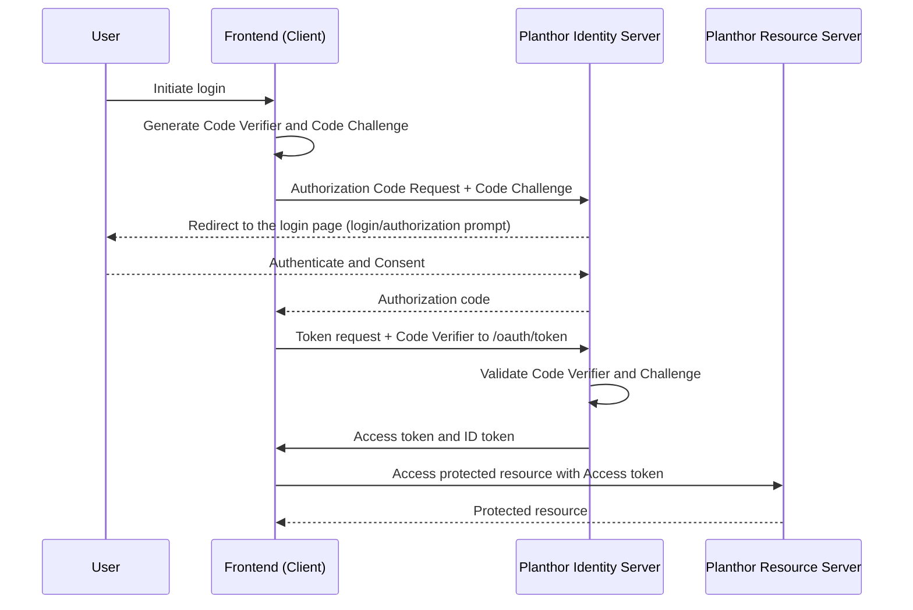

# Epic01 - Authentication
## UC01: Log-In by Facebook Account

### Technical Flow (PKCE)

1. Overview
* **Epic:** Authentication
* **Feature:** Single Sign-On (SSO) via Facebook
* **Primary Actor:** End User (Athlete)
* **Secondary Actor:** Planthor System
* **Tertiary Actor:** Third-Party OAuth Provider (Facebook)

2. Business Perspective (Business Analyst Lens)

 2.1 Business Objectives
- **Frictionless Onboarding:** Maximize user acquisition by minimizing the time and effort required to create an account. Eliminating the need to create, remember, and verify a new password significantly reduces drop-off rates.
- **Trust & Security:** Rely on a trusted tech giant for secure authentication protocols, reducing our internal security overhead for password storage and brute-force mitigation.
- *Note:* We intentionally do NOT pull the user's name or avatar from this social account, deferring identity and profile generation to the subsequent "Connect to Strava" step to ensure our app's ecosystem feels athletic-first rather than generic-social.

 2.2 Success Criteria & KPIs
- **Sign-Up Conversion Rate:** &gt;85% of users who click "Continue with Facebook" successfully complete the login or sign-up process and reach the Strava connection step.
- **Adoption Rate:** &gt;70% of total user base opts for Social Login over traditional Email/Password (if offered).

3. Pre-Conditions
- The user has installed the Planthor application or navigated to the Planthor web portal.
- The user is currently unauthenticated (logged out).
- The user possesses a valid, active Facebook account.

4. Post-Conditions
- **Success (New User):** A new Planthor account is created and mapped to the user's social identity (Email/Provider ID). A secure session token is generated, and the user is redirected immediately to the "Connect to Strava" onboarding screen.
- **Success (Returning User):** A secure session token is generated, and the user is redirected to the User's Dashboard.
- **Failure:** The user remains unauthenticated on the login screen. No account is created, and an appropriate error message is displayed.

5. Main Success Scenario (Happy Path)
* 1. **Trigger:** The user navigates to the Planthor Login/Sign-Up screen.
* 2. **System Response:** The system displays the social login button: "Continue with Facebook".
* 3. **User Action:** The user taps "Continue with Facebook".
* 4. **System Response:** The application redirects the user to the Facebook OAuth consent screen.
* 5. **User Action:** The user selects their Facebook account and authorizes Planthor to authenticate them (sharing only their Email Address and fundamental Account ID).
* 6. **System Response (Facebook):** Facebook authenticates the user and returns an authorization token/code to the Planthor backend.
* 7. **System Response (Planthor):** The backend validates the token and checks if the email address is already registered in the Planthor database.
* 8. **System Response:** Seeing it's a new email, the backend provisions a bare-bones new User Profile (Email & Auth Provider ID), issues a JWT for the local session, and seamlessly logs the user in.
* 9. **System Response:** The app redirects the user to the mandatory "Connect to Strava" onboarding screen.

6. Alternate Flows
- **AF1: Returning User Log-In:**
  - *Context:* The user previously created an account using Facebook.
  - *Flow:* At step 7, the system recognizes the email/Provider ID. It skips the profile generation step, issues a new JWT, and logs the user in directly to the User's Dashboard.

7. Exception Flows & Error States
 7.1 Client-Side / User-Driven Errors
- **EF1: User Denies Authorization:**
  - *Trigger:* At the OAuth consent screen, the user hits "Cancel" or denies Planthor access.
  - *State:* The app returns to the Login screen. A non-intrusive modal or banner appears: "Authentication cancelled. We need basic access to securely create your account. Please try again."
- **EF2: No Internet Connection:**
  - *Trigger:* The user taps the social login button while offline.
  - *State:* The button briefly shows a loading spinner, then resets. A toast notification appears: "No internet connection detected. Please connect and try again."

 7.2 Server-Side / Provider Errors
- **EF3: Provider Outage / Timeout:**
  - *Trigger:* Facebook's API is unresponsive.
  - *State:* After a 10-second timeout, the loading spinner stops. A polite error banner appears: "We're having trouble connecting to Facebook. Please try again in a few moments."

8. Data & Analytics Requirements (Telemetry)
- **Event Tracking:** `view_login_screen`, `click_continue_with_facebook`, `oauth_consent_granted`, `oauth_consent_denied`, `login_success`, `login_failure` (with failure reason).
- **Data Attributes:**
  - `is_new_user` (boolean) to distinguish between sign-ups and logins.

## UC02: Connect to Strava

**1. Overview**
**Feature:** Connect to Strava
**Primary Actor:** End User (Athlete)
**Secondary Actor:** Planthor System
**Tertiary Actor:** Strava API

**2. Business Perspective (Business Analyst Lens)**
**2.1 Business Objectives**
- **Data Foundation:** Strava is the core data engine of the Planthor ecosystem. Establishing this connection is an absolute necessity to read sport sessions, calculate running plan compliance, and fuel the social feed.
- **Athletic Identity Establishment:** Instead of pulling generic profile data from Facebook/Google, Planthor explicitly syncs the user's Name and Avatar directly from their Strava profile. This reinforces the app's aesthetic and branding as a focused tool for athletes.

**2.2 Success Criteria & KPIs**
- **Connection Completion Rate:** &gt;90% of users who successfully log in via FB/Google complete the Strava connection step during initial onboarding.
- **Token Freshness:** &lt;5% of daily active users experiencing expired or revoked Strava tokens.
- **Profile Completeness:** 100% of connected accounts successfully migrate their Strava Display Name and Profile Avatar to their Planthor profile upon first sync.

**3. Pre-Conditions**
- The user is successfully authenticated into the Planthor application (via Facebook or Google).
- The Planthor system holds a valid OAuth application license with Strava (Client ID & Client Secret).

**4. Post-Conditions**
- **Success:** Planthor securely stores the user's `access_token` and `refresh_token` for the Strava API. 
- **Success (Profile Sync):** The user's Planthor local database profile is updated to explicitly mirror their Strava Name and Strava Avatar. 
- **Success:** The user is redirected to the User's Dashboard, now ready to utilize all core features.
- **Failure:** The user profile remains disconnected from Strava. Core features (feeds, plan tracking) remain locked or show blank states.

**5. Main Success Scenario (Happy Path)**
1. **Trigger:** The app seamlessly redirects a newly registered user to the "Connect your Tracker" onboarding screen.
2. **System Response:** The screen displays a "Connect with Strava" CTA button, alongside a brief value proposition ("We need this to track your runs against your plan and populate your athletic profile").
3. **User Action:** The user taps "Connect with Strava".
4. **System Response:** The application redirects the user to the Strava OAuth authorization portal (web or native app deep link).
5. **User Action:** The user reviews the requested permissions (`profile:read_all`, `activity:read_all`) and taps "Authorize".
6. **System Response (Strava):** Strava authenticates the grant and redirects the user back to the Planthor callback URL, providing an authorization code.
7. **System Response (Planthor):** The backend exchanges the short-lived code for permanent `access_token` and `refresh_token` payloads.
8. **System Response (Planthor - Identity Sync):** The backend immediately makes a `GET /athlete` request to Strava using the new token. It extracts the `firstname`, `lastname`, and `profile` (Avatar URL) and saves them into the Planthor User Profile database.
9. **System Response:** The onboarding is marked complete. The user is navigated to the User's Dashboard, fully populated with their Strava identity.

**6. Alternate Flows**
- **AF1: Subsequent Re-Connection / Settings Panel:**
  - *Context:* The user previously connected Strava, but the token was revoked (or they manually disconnected it in Settings).
  - *Flow:* The user triggers the connection from their "Profile &gt; Settings" menu instead of the onboarding flow. Steps 3-8 remain the same, but the post-authorization redirect returns them to the "Settings" menu instead of the Dashboard.
- **AF2: Existing Avatar Overwrite Rule:**
  - *Context:* The user updates their Strava avatar later on.
  - *Flow:* Every time the user logs in, or via a weekly cron job, the system makes a lightweight background check to `GET /athlete` and automatically overwrites the local Planthor database if the Strava Avatar URL has changed.

**7. Exception Flows & Error States**
**7.1 Client-Side / User-Driven Errors**
- **EF1: User Denies Access on Strava Portal:**
  - *Trigger:* The user taps "Cancel" on Strava's authorization screen.
  - *State:* The user is returned to the Planthor onboarding screen. A hard-stop warning appears: "Strava connection is required to track your running plans and profile. Please try again to continue using Planthor." 
  - *Recovery:* The "Connect with Strava" button remains the only actionable element.

**7.2 Server-Side / Provider Errors**
- **EF2: Strava API Rate Limiting / 429 Too Many Requests:**
  - *Trigger:* The app goes viral, and Planthor exhausts its daily Strava API read limits during peak onboarding.
  - *State:* The token exchange (Step 7) or identity sync (Step 8) fails.
  - *Recovery:* The app gracefully fails to the Dashboard, but displays a system-wide banner: "Strava sync is temporarily delayed due to high traffic. We will fetch your profile and runs shortly." The backend queues the identity sync for later.
- **EF3: Invalid Scope Granted:**
  - *Trigger:* The user maliciously modifies the OAuth URL parameters, circumventing the required `activity:read_all` scope.
  - *State:* The backend verifies the token scopes upon return. Realizing it lacks necessary permissions, it rejects the token storage and displays an error: "Insufficient permissions granted. Planthor cannot function without activity access. Please reconnect and leave all boxes checked."

**8. Data & Analytics Requirements (Telemetry)**
- **Event Tracking:** `view_strava_connect_screen`, `click_connect_strava`, `strava_auth_success`, `strava_auth_denied`, `strava_sync_failure`.
- **Data Attributes tracked upon save:** 
  - `time_spent_in_oauth_loop` (seconds).
  - `profile_sync_success` (boolean - did we successfully pull the Avatar and Name?).
- **Privacy & Compliance:** Strava `access_tokens` and `refresh_tokens` must be heavily encrypted at rest in the database. When a user deletes their Planthor account, a mandated web request must be sent to Strava to proactively revoke the token, honoring user data deletion rights.

## UC03: Log Out

**1. Overview**
**Feature:** User Log Out
**Primary Actor:** End User (Athlete)
**Secondary Actor:** Planthor System
**Tertiary Actor:** None

**2. Business Perspective (Business Analyst Lens)**
**2.1 Business Objectives**
- **Security & Privacy:** Ensure that athletes can securely terminate their session, especially when using shared devices, to protect their personal health data and Strava integration metrics.
- **Resource Management:** Efficiently terminate server-side sessions and clean up local cached data to reduce unnecessary background syncing or polling against the Strava API.

**2.2 Success Criteria & KPIs**
- **Logout Success Rate:** 100% of initiated logouts result in successfully cleared local storage and revoked JWTs.
- **Support Tickets:** Near-zero support inquiries reporting "unable to log out" or unauthorized access on previously used devices.

**3. Pre-Conditions**
- The user is currently authenticated and has an active session in the Planthor application.
- The user is actively using the application (e.g., viewing the User's Dashboard or Settings screen).

**4. Post-Conditions**
- **Success:** The user's local session token (JWT) is cleared, locally cached personal data is purged, and the backend invalidates the session. The user is redirected to the Login screen.
- **Failure:** The user remains authenticated, and an error message is presented explaining why the action could not be completed.

**5. Main Success Scenario (Happy Path)**
1. **Trigger:** The user navigates to the "Profile / Settings" interface and taps the "Log Out" CTA.
2. **System Response:** The system presents a confirmation modal: "Are you sure you want to log out?"
3. **User Action:** The user confirms by tapping "Yes, Log Out".
4. **System Response:** The application sends a `POST /logout` request to the Planthor backend to explicitly invalidate the active JWT.
5. **System Response (Planthor):** The backend successfully invalidates the token, blacklists it if necessary, and responds with a 200 OK.
6. **System Response:** The mobile app/web client irreversibly purges all local disk storage (access tokens, locally cached Strava runs, and user profile data) to ensure total privacy.
7. **System Response:** The application successfully redirects the user to the unauthenticated Login/Sign-Up splash screen.

**6. Alternate Flows**
- **AF1: Offline Log Out (Forced Local Clear):**
  - *Context:* The user attempts to log out while in a dead zone or with no active internet connection.
  - *Flow:* The application identifies the offline state. To prioritize security, it immediately purges all local storage and redirects the user to the Login screen. It simultaneously queues a background task to invalidate the JWT on the server the next time the device regains connectivity, ensuring the token cannot be reused elsewhere.

**7. Exception Flows & Error States**
**7.1 Client-Side / User-Driven Errors**
- **EF1: User Cancels Log Out:**
  - *Trigger:* At the confirmation modal, the user taps "Cancel".
  - *State:* The modal closes gracefully. The user remains fully authenticated and remains on the Settings screen.

**7.2 Server-Side / Provider Errors**
- **EF2: Backend Timeout During Log Out:**
  - *Trigger:* The `POST /logout` request times out due to server latency or outage.
  - *State:* The application defaults to the Offline Log Out fail-safe (AF1). It clears the local state, visibly logs the user out from their device, and queues the server-side invalidation flag for retry.

**8. Data & Analytics Requirements (Telemetry)**
- **Event Tracking:** `click_logout`, `logout_confirmed`, `logout_cancelled`, `logout_success_online`, `logout_success_offline`.
- **Data Attributes tracked upon save:** 
  - `session_duration` (minutes: calculated time since the last login event).
- **Privacy & Compliance:** Ensure that the "Log Out" action instantly and irretrievably scrubs local PII (Personally Identifiable Information) from the device cache, fully complying with standard data protection protocols (GDPR/CCPA frameworks).
