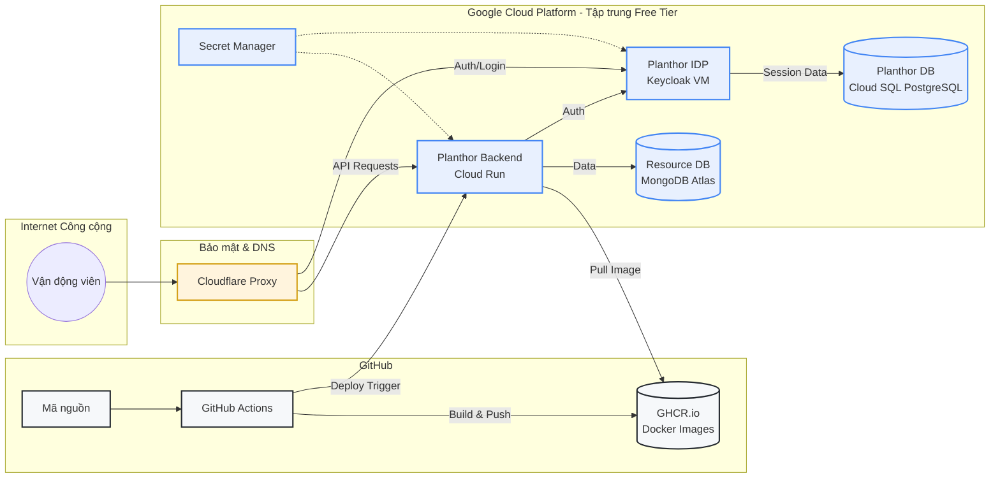
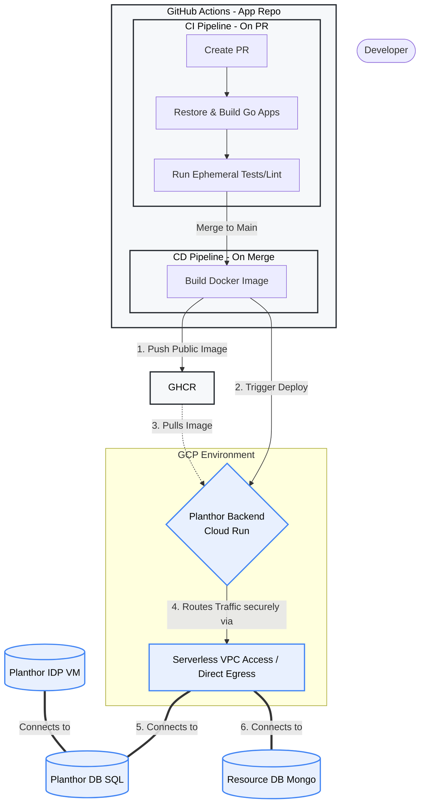
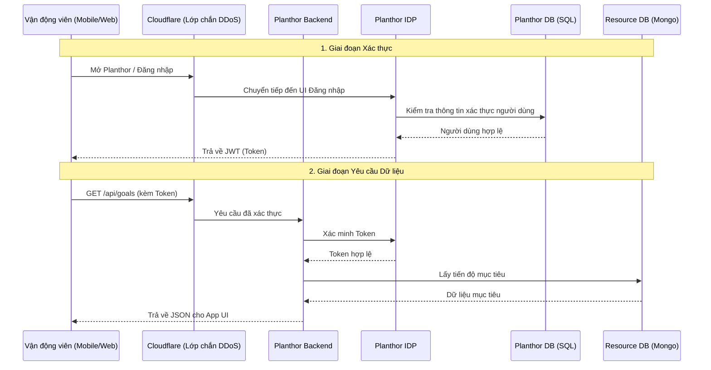

# Cân nhắc Hạ tầng (Chi phí tối ưu và Thực tiễn tốt nhất)

Để tối ưu hóa tốc độ phát triển trong khi vẫn duy trì chi phí hạ tầng gần như bằng không trong giai đoạn phát triển và sandbox của Planthor, kiến trúc đã tận dụng tối đa các thành phần serverless và hạn mức Free Tier của Google Cloud.

### 1. Lưu trữ Ứng dụng & Tính toán
* **Các API Backend:** Được lưu trữ trên **Google Cloud Run**.
  * **Các dịch vụ:** `resourceAPI`, `githubAdapter`, `stravaAdapter`.
  * **Tại sao:** Cloud Run xử lý tốt các đột biến webhook không thường xuyên và có thể giảm xuống mức 0. Việc duy trì trong hạn mức miễn phí 2 triệu yêu cầu/tháng giúp chi phí lưu trữ API ở mức 0$.
* **Nhà cung cấp Danh tính (Keycloak):** Được lưu trữ trên **Google Compute Engine**.
  * **Cấu hình:** 1 máy ảo `e2-micro` triển khai tại vùng đủ điều kiện miễn phí (`us-central1`, `us-east1`, hoặc `us-west1`).
  * **Tại sao:** Keycloak là một ứng dụng Java nặng đòi hỏi các phiên làm việc có trạng thái và gặp vấn đề về độ trễ khởi động lạnh (cold-start) trên các container serverless. Việc chạy trên VM miễn phí giúp tránh các vấn đề này trong khi vẫn giữ chi phí tính toán ở mức 0$.

### 2. Cơ sở dữ liệu
* **Dữ liệu Danh tính & Phiên làm việc:** **Google Cloud SQL cho PostgreSQL**.
  * **Cấu hình:** `db-f1-micro` (vCPU dùng chung, 0.6 GB RAM) với ~10 GB Zonal SSD.
  * **Thiết lập:** Single-zone (Không có tính sẵn sàng cao/Failover) để tránh nhân đôi chi phí.
* **Tài nguyên Ứng dụng:** **MongoDB Atlas** (Hạn mức miễn phí).
  * **Cấu hình:** M0 Sandbox (RAM dùng chung, 512 MB đến 5 GB lưu trữ).
  * **Tại sao:** Cung cấp một cơ sở dữ liệu NoSQL được quản lý hoàn toàn cho các schema mục tiêu/tài nguyên linh hoạt với chi phí 0$.
* **Chiến lược Tối ưu chi phí:** Một công việc định kỳ Cloud Scheduler có thể được triển khai để tự động dừng cơ sở dữ liệu Cloud SQL trong giờ nghỉ để tiết kiệm chi phí tính toán.

### 3. Lưu trữ Container & CI/CD
* **Registry:** **GitHub Container Registry (GHCR)**.
  * **Tại sao:** Thay thế cho Google Artifact Registry. Bằng cách để các Docker image ở chế độ công khai cho dự án mã nguồn mở này, chi phí lưu trữ và băng thông giảm xuống mức 0$. Cloud Run sẽ kéo các image đã biên dịch trực tiếp từ GHCR.

### 4. Mạng & Bảo mật
* **Proxy DNS & Bảo vệ DDoS:** **Cloudflare** (Gói miễn phí).
  * **Định tuyến:** Tên miền tùy chỉnh được định tuyến qua các nameserver của Cloudflare.
  * **Keycloak Entry:** Được proxy đến IP tĩnh bên ngoài của máy ảo Compute Engine để cung cấp bảo vệ DDoS cấp doanh nghiệp và ngăn chặn các cuộc tấn công brute-force vào máy ảo micro.
* **Khóa tường lửa VPC:**
  * **Quy tắc 1 (Lưu lượng Web):** Tất cả lưu lượng internet công cộng đến VM Keycloak trên cổng 80 và 443 đều bị từ chối. Ingress chỉ được cho phép rõ ràng từ các dải IPv4 đã công bố của Cloudflare bằng cách sử dụng thẻ mạng (`keycloak-server`).
  * **Quy tắc 2 (Truy cập SSH):** SSH công cộng (`tcp:22` từ `0.0.0.0/0`) bị từ chối. Ingress SSH bị giới hạn nghiêm ngặt trong dải IP Google Identity-Aware Proxy (IAP) (`35.235.240.0/20`).
* **Quản lý Thông tin xác thực:** **Google Secret Manager** tiêm mật khẩu cơ sở dữ liệu, khóa API GitHub/Strava và thông tin xác thực quản trị Keycloak một cách an toàn vào Cloud Run và máy ảo khi chạy.

## 5. Cấu trúc Tổ chức

## 6. Luồng CI/CD & Triển khai

## 8. Luồng Yêu cầu

