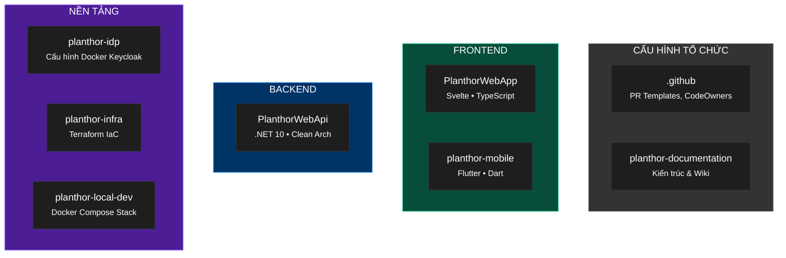
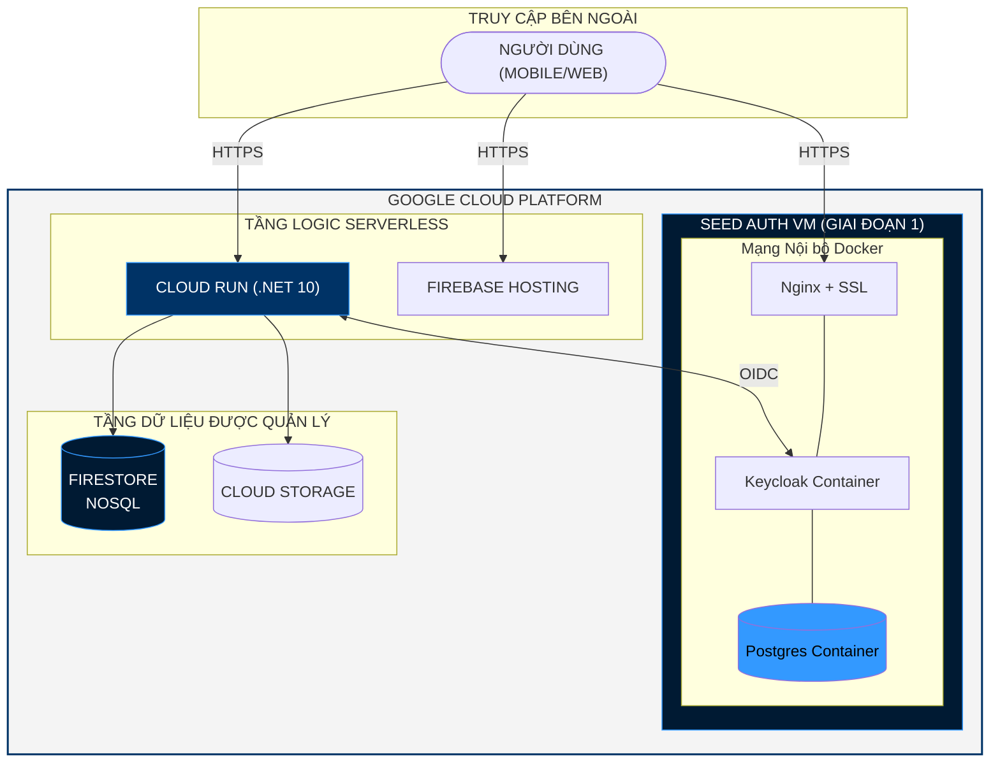
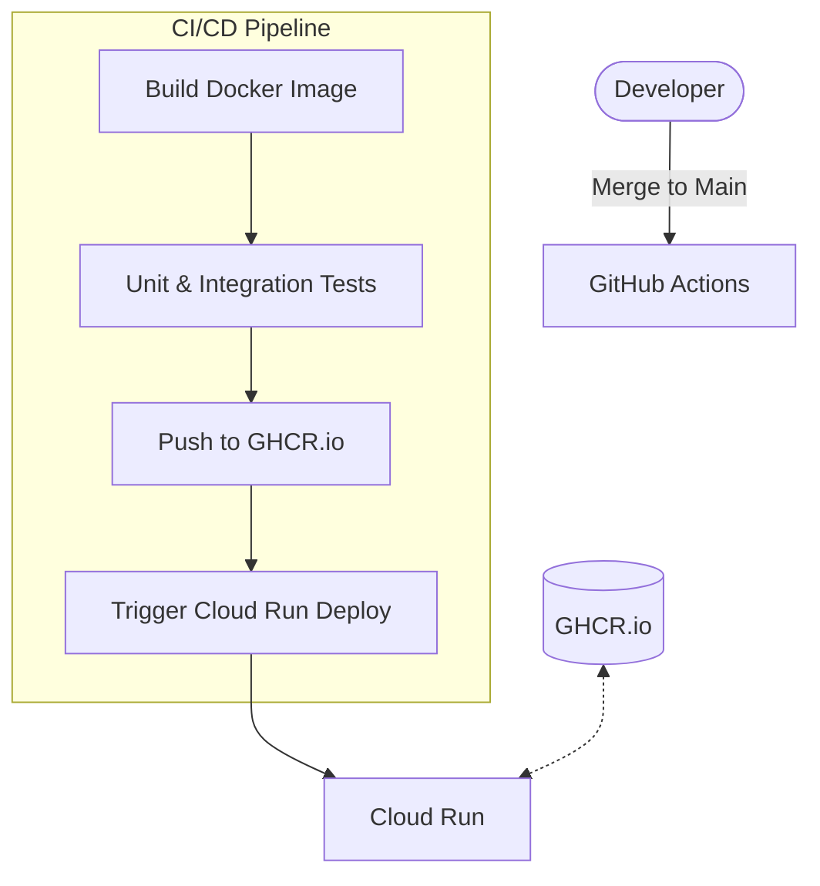
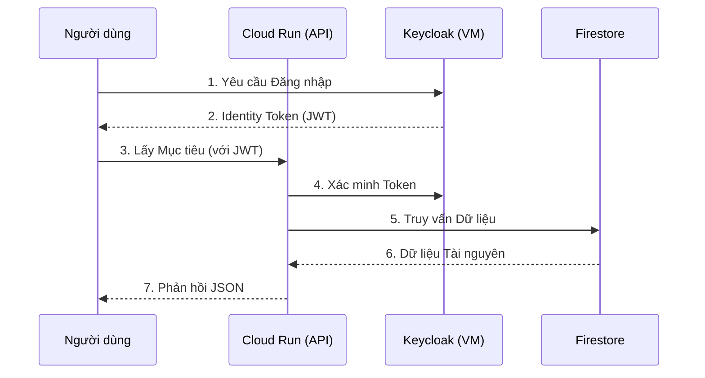

## 1. Cấu trúc Tổ chức (Planthor Monorepo)

Planthor áp dụng chiến lược đa kho lưu trữ (multi-repo) được tổ chức theo các miền chức năng. "Central Wiki" (tài liệu này) đóng vai trò là nguồn sự thật duy nhất cho tất cả các quyết định kiến trúc.



---

## 2. Hạ tầng Sản xuất (Các Giai đoạn Mở rộng)

Để cân bằng giữa chi phí và sự ổn định, Planthor tuân theo chiến lược mở rộng nhiều giai đoạn. Chúng tôi bắt đầu với **Giai đoạn Seed** để đạt được môi trường sản xuất chỉ với ~$14/tháng.

### Giai đoạn 1: Seed Phase (Hiện tại)
*   **Tính toán:** Một VM `e2-small` duy nhất (2GB RAM) chạy **Docker Compose**.
*   **Auth Stack:** Keycloak + Postgres + Nginx (tất cả trong Docker).
*   **Logic Stack:** **Cloud Run** (.NET 10) tự động giảm về 0 khi không sử dụng.
*   **Data Stack:** **Firestore** (NoSQL Serverless).

### Giai đoạn 2: Growth Phase (Tương lai)
*   **Cơ sở dữ liệu:** Chuyển sang **Cloud SQL (PostgreSQL)** để quản lý sao lưu tự động.
*   **Bộ nhớ đệm:** Giới thiệu **Cloud Memorystore (Redis)** để tối ưu hiệu suất phiên làm việc.

---

## 3. Sơ đồ Hạ tầng (Giai đoạn Seed)



---

## 4. Ước tính Chi phí Hàng tháng

| GIAI ĐOẠN | CÁC THÀNH PHẦN | CHI PHÍ ƯỚC TÍNH |
| :--- | :--- | :--- |
| **GIAI ĐOẠN 1 (Seed)** | VM `e2-small` + Cloud Run + Firestore | **~$14.00** |
| **GIAI ĐOẠN 2 (Growth)** | VM + Cloud SQL + Cloud Run | **~$25.00** |
| **GIAI ĐOẠN 3 (Scale)** | HA Cluster + Load Balancer + WAF | **$60.00+** |

---

## 5. Tối ưu hóa Docker (e2-small)

Vì máy ảo `e2-small` chỉ có **2GB RAM**, các container Docker phải được giới hạn nghiêm ngặt.

### Giới hạn Tài nguyên
Trong `docker-compose.yml`, luôn xác định giới hạn để ngăn một container làm treo toàn bộ VM:
```yaml
services:
  keycloak:
    deploy:
      resources:
        limits:
          memory: 1200M
        reservations:
          memory: 800M
  postgres:
    deploy:
      resources:
        limits:
          memory: 400M
```

### Tối ưu hóa Nhật ký (Logging)
Để ngăn chặn việc đầy ổ cứng trên VM nhỏ, hãy sử dụng driver `json-file` với tính năng xoay vòng (rotation):
```yaml
logging:
  driver: "json-file"
  options:
    max-size: "10m"
    max-file: "3"
```

---

## 6. Luồng CI/CD & Triển khai



---

## 7. Giám sát & Sức khỏe

1.  **Kiểm tra Liveness:** `https://auth.planthor.com/health/live` (Được giám sát bởi UptimeRobot).
2.  **Kiểm tra Tài nguyên:** SSH vào VM và chạy `docker stats` hàng tuần.
3.  **Nhật ký:** Cài đặt **GCP Ops Agent** trên VM để truyền nhật ký về Cloud Logging.

---

## 8. Luồng Yêu cầu (Đầu-cuối)


