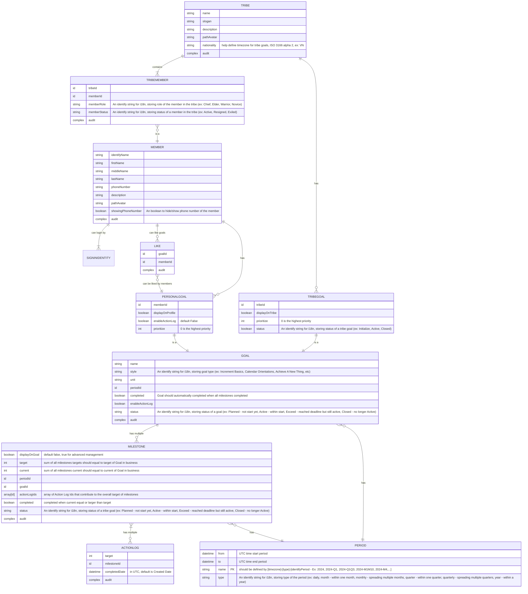

# Sơ đồ

```mermaid
erDiagram
  TRIBE ||--|{ TRIBEMEMBER : contains
  TRIBEMEMBER }o--|| MEMBER : "is a"
  MEMBER ||--|{ SIGNINIDENTITY : "can login by"
  MEMBER ||--o{ LIKE : "can like goals"
  LIKE }o--|| PERSONALGOAL : "can be liked by members"
  TRIBE ||--o{ TRIBEGOAL : has
  MEMBER ||--o{ PERSONALGOAL : has
  TRIBEGOAL ||--|| GOAL : "is a"
  PERSONALGOAL ||--|| GOAL : "is a"
  GOAL ||--o{ MILESTONE : "has multiple"
  MILESTONE }|--o{ ACTIONLOG : "has multiple"
  MILESTONE }o--|| PERIOD : has
  GOAL }o--|| PERIOD : has
  TRIBE {
    string name
    string slogan
    string description
    string pathAvatar
    string nationality "help define timezone for tribe goals, ISO 3166 alpha 2, ex: VN"
    complex audit
  }
  TRIBEMEMBER {
    id tribeId
    id memberId
    string memberRole "An identify string for i18n, storing role of the member in the tribe (ex: Chief, Elder, Warrior, Novice)"
    string memberStatus "An identify string for i18n, storing status of a member in the tribe (ex: Active, Resigned, Exiled)" 
    complex audit
  }
  MEMBER {
    string identifyName
    string firstName
    string middleName
    string lastName
    string phoneNumber
    string description
    string pathAvatar
    boolean showingPhoneNumber "An boolean to hide/show phone number of the member"
    complex audit
  }
  PERSONALGOAL {
    id memberId
    boolean displayOnProfile
    boolean enableActionLog "default False"
    int prioritize "0 is the highest priority"
  }
  LIKE {
    id goalId
    id memberId
    complex audit
  }
  TRIBEGOAL {
    id tribeId
    boolean displayOnTribe
    int prioritize "0 is the highest priority"
    boolean status "An identify string for i18n, storing status of a tribe goal (ex: Initialize, Active, Closed)"
  }
  GOAL {
    string name
    string style "An identify string for i18n, storing goal type (ex: Increment Basics, Calendar Orientations, Achieve A New Thing, etc)"
    string unit
    id periodId
    boolean completed "Goal should automatically completed when all milestones completed"
    boolean enableActionLog
    string status "An identify string for i18n, storing status of a goal (ex: Planned - not start yet, Active - within start, Exceed - reached deadline but still active, Closed - no longer Active)"
    complex audit
  }
  MILESTONE {
    boolean displayOnGoal "default false, true for advanced management"
    int target "sum of all milestones targets should equal to target of Goal in business"
    int current "sum of all milestones current should equal to current of Goal in business"
    id periodId
    id goalId
    array[id] actionLogIds "array of Action Log Ids that contribute to the overall target of milestones"
    boolean completed "completed when current equal or larger than target"
    string status "An identify string for i18n, storing status of a tribe goal (ex: Planned - not start yet, Active - within start, Exceed - reached deadline but still active, Closed - no longer Active)"
    complex audit
  }
  ACTIONLOG {
    int target
    id milestoneId
    datetime completedDate "in UTC, default is Created Date"
    complex audit
  }
  PERIOD {
    datetime from "UTC time start period"
    datetime to "UTC time end period"
    string name PK "should be defined by [timezone]-[type]-[identifyPeriod - Ex: 2024, 2024-Q1, 2024-Q1Q3, 2024-M1M10, 2024-M4,...]"
    string type "An identify string for i18n, storing type of the period (ex: daily, month - within one month, monthly - spreading multiple months, quarter - within one quarter, quarterly - spreading multiple quarters, year - within a year)"
  }
```
