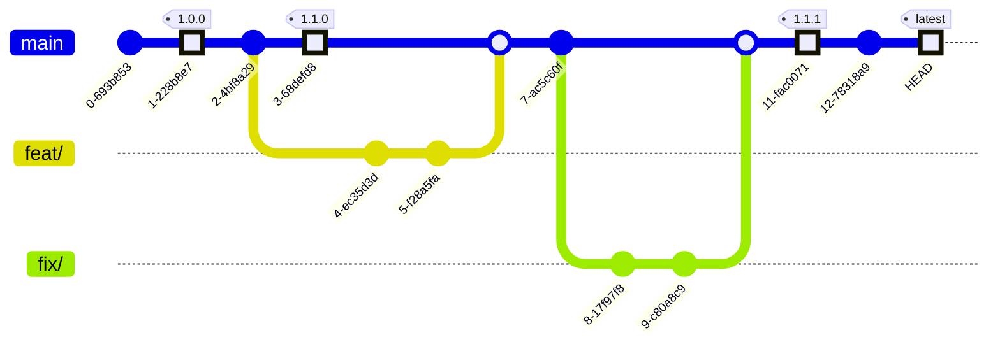

# Sơ đồ

## Kế hoạch phát hành dự kiến

Theo định hướng:

- `major` = hàng năm
- `minor` = hàng quý
- `patch` = hàng tháng/quan trọng
- `main` = mới nhất

## Tuyên bố miễn trừ trách nhiệm

Chúng tôi sẽ không duy trì các phiên bản cũ của "major" và "minor".
