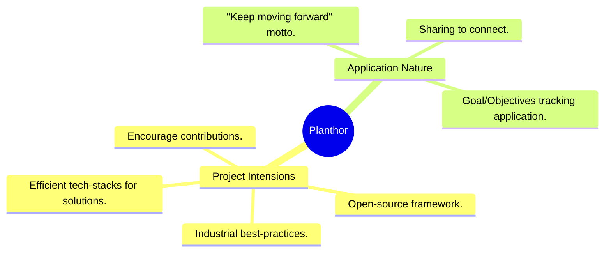
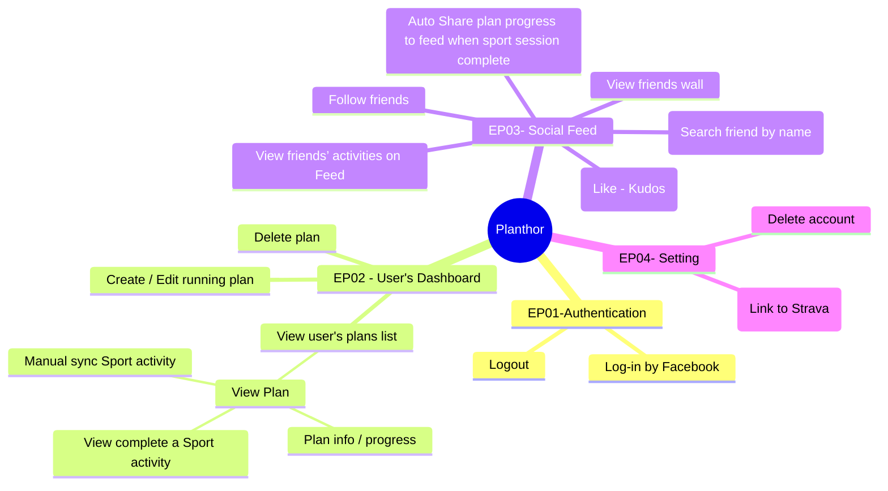

# Giới thiệu

Chào mừng quý vị đến với tài liệu hướng dẫn của Planthor! Tại đây, quý vị có thể tìm thấy hầu hết các thông tin cần thiết khi tương tác với dự án Planthor.

## Mục tiêu dự án

Planthor là một ứng dụng theo dõi mục tiêu/định hướng nguồn mở, được thiết kế để hỗ trợ hành trình của cộng đồng "Dragging to Dream" (D2D). Bằng cách cung cấp một nền tảng để theo dõi tiến độ và chia sẻ thành tựu, Planthor nuôi dưỡng tinh thần "luôn tiến về phía trước" và khuyến khích các đóng góp cho chính khung làm việc này. Điều này tạo ra một môi trường cộng tác, nơi các thành viên D2D có thể kết nối, học hỏi lẫn nhau và liên tục phát triển kỹ năng của mình.

## Hướng dẫn Chương trình 2026

Chúng tôi không còn đơn thuần là một chương trình học tập; chúng tôi hướng đến tính hiệu quả và cung cấp các giải pháp thực tiễn.
Chúng tôi sẽ nỗ lực áp dụng các thực tiễn tốt nhất theo tiêu chuẩn công nghiệp vào dự án của mình.

