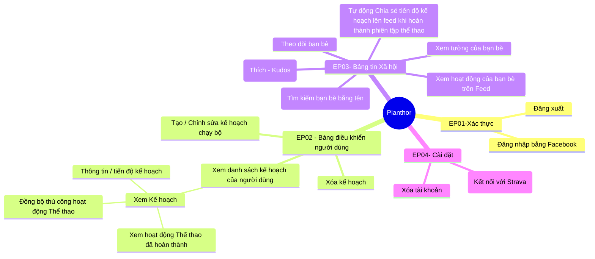

# Lộ trình phát triển (Roadmap)
 Product Roadmap: Planthor

**Được chuẩn bị bởi:** Product Manager
**Năng lực đội ngũ:** 1 Frontend Engineer (FE), 1 Backend Engineer (BE), 1 DevOps Engineer, 1 Product Owner (PO).

---

## 1. Khung ưu tiên (MoSCoW)

Để tối đa hóa thiết lập đội ngũ tinh gọn và giảm thời gian đưa ra thị trường, chúng tôi áp dụng khung MoSCoW. Mục tiêu chính của chúng tôi là xác thực giá trị cốt lõi của người dùng (tiện ích đào tạo cá nhân) trước khi đầu tư vào hiệu ứng mạng (tính năng xã hội).

- **Must-Have (MVP):** EP01-Authentication, EP04-Setting (Strava Link), và EP02-Dashboard (Core Plan CRUD và Manual Sync).
- **Should-Have (V1.1):** Nền tảng EP03-Social Feed (Đồ thị theo dõi, xem Bảng tin).
- **Could-Have (V1.2):** Vòng lặp tương tác lan tỏa (Kudos, Tự động chia sẻ hoạt động).

---

## 2. Lộ trình thực hiện theo giai đoạn

### Giai đoạn 1: MVP - Tiện ích cốt lõi & Công cụ duy trì

**Mục tiêu:** Cung cấp trải nghiệm nền tảng cho người dùng đơn lẻ. Người dùng phải có thể xác thực an toàn, kết nối nguồn theo dõi (Strava) và quản lý trực quan các kế hoạch chạy bộ của họ.

**Các tính năng chính:**
- **Authentication (EP01):** Đăng nhập bằng Facebook, Đăng xuất.
- **Settings & Data Integration (EP04):** Liên kết với Strava (OAuth), Xóa tài khoản (Tuân thủ).
- **User's Dashboard (EP02):**
  - Tạo / Chỉnh sửa kế hoạch chạy bộ.
  - Xóa kế hoạch.
  - Xem danh sách kế hoạch của người dùng.
  - Xem Kế hoạch (Thông tin kế hoạch / tiến độ).
  - Xem hoàn thành một hoạt động thể thao.
  - Đồng bộ thủ công hoạt động thể thao (Cách tiếp cận tinh gọn ban đầu để thu thập dữ liệu).

### Giai đoạn 2: Khám phá xã hội & Nền tảng mạng lưới

**Mục tiêu:** Chuyển đổi từ một tiện ích cho người dùng đơn lẻ sang một cộng đồng nhiều người chơi. Người dùng có thể kết nối với những người khác và xem hoạt động cá nhân bằng cách truy cập trực tiếp vào tường cá nhân của bạn bè.

**Các tính năng chính:**
- **Social Network Core (EP03):**
  - Tìm kiếm bạn bè theo tên.
  - Theo dõi bạn bè.
  - Xem tường của bạn bè.

### Giai đoạn 3: Bảng tin xã hội, Tương tác sâu & Vòng lặp lan tỏa

**Mục tiêu:** Kích thích DAU thông qua Bảng tin xã hội tổng hợp, xác thực xã hội không ma sát (Kudos) và cơ chế chia sẻ tự động.

**Các tính năng chính:**
- **Social Feed & Engagement (EP03):**
  - Xem hoạt động của bạn bè trên Bảng tin (Dòng thời gian tổng hợp).
  - Thích - Kudos.
  - Tự động chia sẻ tiến độ kế hoạch lên bảng tin khi hoàn thành phiên tập thể thao.
