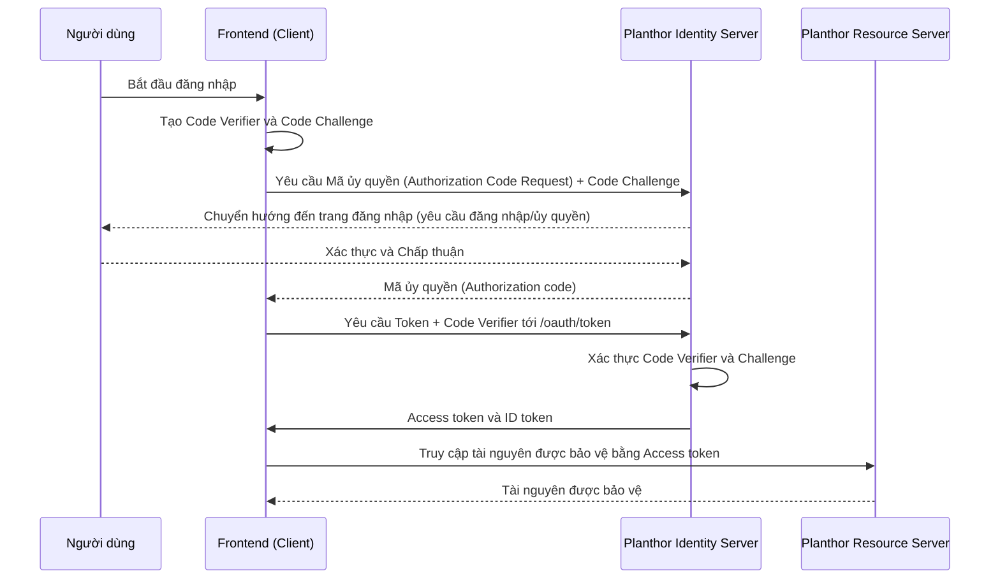

# Epic01 - Xác thực
## UC01: Đăng nhập bằng tài khoản Facebook

### Luồng Kỹ thuật (PKCE)

1. Tổng quan
* **Epic:** Authentication
* **Tính năng:** Single Sign-On (SSO) via Facebook
* **Tác nhân chính:** Người dùng cuối (Athlete)
* **Tác nhân phụ:** Planthor System
* **Tác nhân thứ ba:** Third-Party OAuth Provider (Facebook)

2. Góc nhìn Kinh doanh (Ống kính Chuyên viên Phân tích Nghiệp vụ)

 2.1 Mục tiêu Kinh doanh
- **Frictionless Onboarding:** Tối đa hóa việc thu hút người dùng bằng cách giảm thiểu thời gian và nỗ lực cần thiết để tạo tài khoản. Việc loại bỏ nhu cầu tạo, ghi nhớ và xác minh mật khẩu mới giúp giảm đáng kể tỷ lệ người dùng bỏ dở.
- **Tin cậy & Bảo mật:** Dựa trên một gã khổng lồ công nghệ đáng tin cậy cho các giao thức xác thực an toàn, giảm tải chi phí bảo mật nội bộ của chúng tôi cho việc lưu trữ mật khẩu và giảm thiểu các cuộc tấn công vét cạn (brute-force).
- *Lưu ý:* Chúng tôi cố tình KHÔNG lấy tên hoặc ảnh đại diện của người dùng từ tài khoản mạng xã hội này, trì hoãn việc tạo danh tính và hồ sơ sang bước "Kết nối với Strava" tiếp theo để đảm bảo hệ sinh thái của ứng dụng mang cảm giác ưu tiên cho thể thao hơn là mạng xã hội thông thường.

 2.2 Tiêu chí thành công & KPIs
- **Sign-Up Conversion Rate:** &gt;85% người dùng nhấp vào "Continue with Facebook" hoàn thành thành công quá trình đăng nhập hoặc đăng ký và đạt đến bước kết nối Strava.
- **Tỷ lệ áp dụng:** &gt;70% tổng số người dùng lựa chọn Đăng nhập Xã hội thay vì Email/Mật khẩu truyền thống (nếu được cung cấp).

3. Điều kiện tiên quyết
- Người dùng đã cài đặt ứng dụng Planthor hoặc truy cập cổng thông tin web Planthor.
- Người dùng hiện chưa được xác thực (đã đăng xuất).
- Người dùng sở hữu tài khoản Facebook hợp lệ và đang hoạt động.

4. Điều kiện sau thực hiện
- **Thành công (Người dùng mới):** Một tài khoản Planthor mới được tạo và ánh xạ tới danh tính xã hội của người dùng (Email/Provider ID). Một mã thông báo phiên an toàn được tạo và người dùng được chuyển hướng ngay lập tức đến màn hình hướng dẫn "Kết nối với Strava".
- **Thành công (Người dùng cũ):** Một mã thông báo phiên an toàn được tạo và người dùng được chuyển hướng đến Bảng điều khiển người dùng.
- **Thất bại:** Người dùng vẫn chưa được xác thực trên màn hình đăng nhập. Không có tài khoản nào được tạo và một thông báo lỗi thích hợp được hiển thị.

5. Kịch bản Thành công Chính (Happy Path)
* 1. **Trigger:** Người dùng điều hướng đến màn hình Đăng nhập/Đăng ký Planthor.
* 2. **Phản hồi hệ thống:** Hệ thống hiển thị nút đăng nhập xã hội: "Continue with Facebook".
* 3. **Hành động người dùng:** Người dùng nhấn "Continue with Facebook".
* 4. **Phản hồi hệ thống:** Ứng dụng chuyển hướng người dùng đến màn hình chấp thuận Facebook OAuth.
* 5. **Hành động người dùng:** Người dùng chọn tài khoản Facebook của họ và cho phép Planthor xác thực họ (chỉ chia sẻ Địa chỉ Email và ID tài khoản cơ bản).
* 6. **Phản hồi hệ thống (Facebook):** Facebook xác thực người dùng và trả lại mã thông báo/mã ủy quyền cho backend Planthor.
* 7. **Phản hồi hệ thống (Planthor):** Backend xác thực mã thông báo và kiểm tra xem địa chỉ email đã được đăng ký trong cơ sở dữ liệu Planthor hay chưa.
* 8. **Phản hồi hệ thống:** Nhận thấy đó là một email mới, backend cung cấp một Hồ sơ Người dùng mới cơ bản (Email & Auth Provider ID), cấp JWT cho phiên cục bộ và đăng nhập người dùng một cách liền mạch.
* 9. **Phản hồi hệ thống:** Ứng dụng chuyển hướng người dùng đến màn hình hướng dẫn bắt buộc "Kết nối với Strava".

6. Luồng thay thế
- **AF1: Returning User Log-In:**
  - *Bối cảnh:* Người dùng trước đó đã tạo tài khoản bằng Facebook.
  - *Luồng:* Tại bước 7, hệ thống nhận dạng email/Provider ID. Nó bỏ qua bước tạo hồ sơ, cấp một JWT mới và đăng nhập người dùng trực tiếp vào Bảng điều khiển người dùng.

7. Luồng ngoại lệ & Trạng thái lỗi
 7.1 Lỗi phía Client / Do người dùng
- **EF1: Người dùng từ chối ủy quyền:**
  - *Trigger:* Tại màn hình chấp thuận OAuth, người dùng nhấn "Cancel" hoặc từ chối quyền truy cập của Planthor.
  - *Trạng thái:* Ứng dụng quay lại màn hình Đăng nhập. Một thông báo modal hoặc biểu ngữ không xâm lấn xuất hiện: "Xác thực đã bị hủy. Chúng tôi cần quyền truy cập cơ bản để tạo tài khoản của quý vị một cách an toàn. Vui lòng thử lại."
- **EF2: Không có kết nối Internet:**
  - *Trigger:* Người dùng nhấn nút đăng nhập xã hội khi đang ngoại tuyến.
  - *Trạng thái:* Nút hiển thị biểu tượng tải trong giây lát, sau đó đặt lại. Một thông báo hiện lên: "Không tìm thấy kết nối internet. Vui lòng kết nối và thử lại."

 7.2 Lỗi phía Server / Nhà cung cấp
- **EF3: Nhà cung cấp ngừng hoạt động / Hết thời gian chờ:**
  - *Trigger:* API của Facebook không phản hồi.
  - *Trạng thái:* Sau 10 giây hết thời gian chờ, biểu tượng tải dừng lại. Một biểu ngữ lỗi lịch sự xuất hiện: "Chúng tôi đang gặp sự cố khi kết nối với Facebook. Vui lòng thử lại sau giây lát."

8. Yêu cầu Dữ liệu & Phân tích (Telemetry)
- **Theo dõi sự kiện:** `view_login_screen`, `click_continue_with_facebook`, `oauth_consent_granted`, `oauth_consent_denied`, `login_success`, `login_failure` (với lý do thất bại).
- **Thuộc tính dữ liệu:**
  - `is_new_user` (boolean) để phân biệt giữa đăng ký mới và đăng nhập.

## UC02 - Connect to Strava

**1. Tổng quan**
**Tính năng:** Connect to Strava
**Tác nhân chính:** Người dùng cuối (Athlete)
**Tác nhân phụ:** Planthor System
**Tác nhân thứ ba:** Strava API

**2. Góc nhìn Kinh doanh (Ống kính Chuyên viên Phân tích Nghiệp vụ)**
**2.1 Mục tiêu Kinh doanh**
- **Data Foundation:** Strava là công cụ dữ liệu cốt lõi của hệ sinh thái Planthor. Việc thiết lập kết nối này là một sự cần thiết tuyệt đối để đọc các phiên tập thể thao, tính toán sự tuân thủ kế hoạch chạy bộ và cung cấp dữ liệu cho bảng tin xã hội.
- **Thiết lập danh tính thể thao:** Thay vì lấy dữ liệu hồ sơ chung chung từ Facebook/Google, Planthor đồng bộ hóa rõ ràng Tên và Ảnh đại diện của người dùng trực tiếp từ hồ sơ Strava của họ. Điều này củng cố thẩm mỹ và thương hiệu của ứng dụng như một công cụ chuyên biệt cho các vận động viên.

**2.2 Tiêu chí thành công & KPIs**
- **Connection Completion Rate:** &gt;90% người dùng đăng nhập thành công qua FB/Google hoàn thành bước kết nối Strava trong quá trình hướng dẫn ban đầu.
- **Token Freshness:** &lt;5% người dùng hoạt động hàng ngày gặp phải mã thông báo Strava hết hạn hoặc bị thu hồi.
- **Profile Completeness:** 100% các tài khoản được kết nối di chuyển thành công Tên hiển thị Strava và Ảnh đại diện hồ sơ sang hồ sơ Planthor của họ ngay lần đồng bộ đầu tiên.

**3. Điều kiện tiên quyết**
- Người dùng đã xác thực thành công vào ứng dụng Planthor (qua Facebook hoặc Google).
- Hệ thống Planthor có giấy phép ứng dụng OAuth hợp lệ với Strava (Client ID & Client Secret).

**4. Điều kiện sau thực hiện**
- **Thành công:** Planthor lưu trữ an toàn `access_token` và `refresh_token` của người dùng cho Strava API. 
- **Thành công (Đồng bộ hồ sơ):** Hồ sơ cơ sở dữ liệu cục bộ Planthor của người dùng được cập nhật để phản ánh chính xác Tên Strava và Ảnh đại diện Strava của họ. 
- **Thành công:** Người dùng được chuyển hướng đến Bảng điều khiển người dùng, hiện đã sẵn sàng để sử dụng tất cả các tính năng cốt lõi.
- **Thất bại:** Hồ sơ người dùng vẫn chưa được kết nối với Strava. Các tính năng cốt lõi (bảng tin, theo dõi kế hoạch) vẫn bị khóa hoặc hiển thị trạng thái trống.

**5. Kịch bản Thành công Chính (Happy Path)**
1. **Trigger:** Ứng dụng chuyển hướng liền mạch người dùng mới đăng ký đến màn hình hướng dẫn "Kết nối thiết bị theo dõi".
2. **Phản hồi hệ thống:** Màn hình hiển thị nút CTA "Connect with Strava", cùng với một đề xuất giá trị ngắn gọn ("Chúng tôi cần điều này để theo dõi các lần chạy của quý vị so với kế hoạch và điền thông tin vào hồ sơ thể thao của quý vị").
3. **Hành động người dùng:** Người dùng nhấn "Connect with Strava".
4. **Phản hồi hệ thống:** Ứng dụng chuyển hướng người dùng đến cổng ủy quyền Strava OAuth (web hoặc liên kết sâu của ứng dụng gốc).
5. **Hành động người dùng:** Người dùng xem xét các quyền được yêu cầu (`profile:read_all`, `activity:read_all`) và nhấn "Authorize".
6. **Phản hồi hệ thống (Strava):** Strava xác thực việc cấp quyền và chuyển hướng người dùng quay lại URL gọi lại của Planthor, cung cấp mã ủy quyền.
7. **Phản hồi hệ thống (Planthor):** Backend trao đổi mã ngắn hạn để lấy các gói dữ liệu `access_token` và `refresh_token` vĩnh viễn.
8. **Phản hồi hệ thống (Planthor - Đồng bộ danh tính):** Backend ngay lập tức thực hiện yêu cầu `GET /athlete` tới Strava bằng mã thông báo mới. Nó trích xuất `firstname`, `lastname`, và `profile` (URL ảnh đại diện) và lưu chúng vào cơ sở dữ liệu Hồ sơ người dùng Planthor.
9. **Phản hồi hệ thống:** Quá trình hướng dẫn được đánh dấu hoàn thành. Người dùng được điều hướng đến Bảng điều khiển người dùng, được điền đầy đủ danh tính Strava của họ.

**6. Luồng thay thế**
- **AF1: Kết nối lại / Bảng cài đặt:**
  - *Bối cảnh:* Người dùng trước đó đã kết nối Strava, nhưng mã thông báo đã bị thu hồi (hoặc họ đã ngắt kết nối thủ công trong Cài đặt).
  - *Luồng:* Người dùng kích hoạt kết nối từ menu "Profile &gt; Settings" thay vì luồng hướng dẫn ban đầu. Các bước từ 3-8 giữ nguyên, nhưng chuyển hướng sau ủy quyền sẽ đưa họ quay lại menu "Cài đặt" thay vì Bảng điều khiển.
- **AF2: Quy tắc ghi đè ảnh đại diện hiện có:**
  - *Bối cảnh:* Người dùng cập nhật ảnh đại diện Strava sau đó.
  - *Luồng:* Mỗi khi người dùng đăng nhập, hoặc thông qua một tác vụ định kỳ hàng tuần, hệ thống sẽ thực hiện kiểm tra ngầm nhẹ nhàng tới `GET /athlete` và tự động ghi đè cơ sở dữ liệu Planthor cục bộ nếu URL ảnh đại diện Strava đã thay đổi.

**7. Luồng ngoại lệ & Trạng thái lỗi**
**7.1 Lỗi phía Client / Do người dùng**
- **EF1: Người dùng từ chối truy cập trên cổng Strava:**
  - *Trigger:** Người dùng nhấn "Cancel" trên màn hình ủy quyền của Strava.
  - *Trạng thái:* Người dùng được đưa quay lại màn hình hướng dẫn Planthor. Một cảnh báo bắt buộc xuất hiện: "Kết nối Strava là bắt buộc để theo dõi kế hoạch chạy bộ và hồ sơ của quý vị. Vui lòng thử lại để tiếp tục sử dụng Planthor." 
  - *Khắc phục:* Nút "Connect with Strava" vẫn là yếu tố hành động duy nhất.

**7.2 Lỗi phía Server / Nhà cung cấp**
- **EF2: API Strava bị giới hạn tốc độ / 429 Quá nhiều yêu cầu:**
  - *Trigger:* Ứng dụng trở nên phổ biến đột ngột và Planthor cạn kiệt giới hạn đọc API Strava hàng ngày trong giờ cao điểm hướng dẫn người dùng mới.
  - *Trạng thái:* Việc trao đổi mã thông báo (Bước 7) hoặc đồng bộ danh tính (Bước 8) thất bại.
  - *Khắc phục:* Ứng dụng thất bại một cách nhẹ nhàng tới Bảng điều khiển, nhưng hiển thị một biểu ngữ toàn hệ thống: "Việc đồng bộ Strava tạm thời bị trì hoãn do lưu lượng truy cập cao. Chúng tôi sẽ lấy hồ sơ và các lần chạy của quý vị sớm." Backend đưa việc đồng bộ danh tính vào hàng đợi để xử lý sau.
- **EF3: Phạm vi (Scope) được cấp không hợp lệ:**
  - *Trigger:* Người dùng cố tình sửa đổi các tham số URL OAuth, bỏ qua phạm vi `activity:read_all` bắt buộc.
  - *Trạng thái:* Backend xác minh các phạm vi mã thông báo khi nhận được. Nhận thấy thiếu các quyền cần thiết, nó từ chối lưu trữ mã thông báo và hiển thị lỗi: "Quyền được cấp không đủ. Planthor không thể hoạt động nếu không có quyền truy cập hoạt động. Vui lòng kết nối lại và để tất cả các ô được chọn."

**8. Yêu cầu Dữ liệu & Phân tích (Telemetry)**
- **Theo dõi sự kiện:** `view_strava_connect_screen`, `click_connect_strava`, `strava_auth_success`, `strava_auth_denied`, `strava_sync_failure`.
- **Thuộc tính dữ liệu được theo dõi khi lưu:** 
  - `time_spent_in_oauth_loop` (giây).
  - `profile_sync_success` (boolean - chúng ta có lấy thành công Ảnh đại diện và Tên không?).
- **Bảo mật & Tuân thủ:** `access_tokens` và `refresh_tokens` của Strava phải được mã hóa mạnh khi lưu trữ trong cơ sở dữ liệu. Khi người dùng xóa tài khoản Planthor của họ, một yêu cầu web bắt buộc phải được gửi tới Strava để chủ động thu hồi mã thông báo, tôn trọng quyền xóa dữ liệu của người dùng.

## UC03 - Log Out

**1. Tổng quan**
**Tính năng:** User Log Out
**Tác nhân chính:** Người dùng cuối (Athlete)
**Tác nhân phụ:** Planthor System
**Tác nhân thứ ba:** Không có

**2. Góc nhìn Kinh doanh (Ống kính Chuyên viên Phân tích Nghiệp vụ)**
**2.1 Mục tiêu Kinh doanh**
- **Bảo mật & Quyền riêng tư:** Đảm bảo rằng các vận động viên có thể chấm dứt phiên làm việc của họ một cách an toàn, đặc biệt khi sử dụng các thiết bị dùng chung, để bảo vệ dữ liệu sức khỏe cá nhân và các chỉ số tích hợp Strava.
- **Quản lý tài nguyên:** Chấm dứt hiệu quả các phiên làm việc phía máy chủ và dọn dẹp dữ liệu lưu tạm cục bộ để giảm việc đồng bộ hóa ngầm hoặc thăm dò không cần thiết tới Strava API.

**2.2 Tiêu chí thành công & KPIs**
- **Logout Success Rate:** 100% các yêu cầu đăng xuất dẫn đến việc xóa thành công bộ nhớ cục bộ và thu hồi các JWT.
- **Yêu cầu hỗ trợ:** Gần như không có yêu cầu hỗ trợ nào báo cáo "không thể đăng xuất" hoặc truy cập trái phép trên các thiết bị đã sử dụng trước đó.

**3. Điều kiện tiên quyết**
- Người dùng hiện đang được xác thực và có một phiên làm việc đang hoạt động trong ứng dụng Planthor.
- Người dùng đang tích cực sử dụng ứng dụng (ví dụ: đang xem Bảng điều khiển người dùng hoặc màn hình Cài đặt).

**4. Điều kiện sau thực hiện**
- **Thành công:** Mã thông báo phiên cục bộ (JWT) của người dùng được xóa, dữ liệu cá nhân lưu tạm cục bộ được dọn dẹp và backend hủy bỏ phiên làm việc. Người dùng được chuyển hướng đến màn hình Đăng nhập.
- **Thất bại:** Người dùng vẫn được xác thực và một thông báo lỗi được đưa ra giải thích lý do tại sao hành động không thể hoàn thành.

**5. Kịch bản Thành công Chính (Happy Path)**
1. **Trigger:** Người dùng điều hướng đến giao diện "Hồ sơ / Cài đặt" và nhấn nút "Log Out".
2. **Phản hồi hệ thống:** Hệ thống hiển thị một modal xác nhận: "Quý vị có chắc chắn muốn đăng xuất không?"
3. **Hành động người dùng:** Người dùng xác nhận bằng cách nhấn "Yes, Log Out".
4. **Phản hồi hệ thống:** Ứng dụng gửi yêu cầu `POST /logout` tới backend Planthor để hủy bỏ rõ ràng JWT đang hoạt động.
5. **Phản hồi hệ thống (Planthor):** Backend hủy bỏ thành công mã thông báo, đưa vào danh sách đen nếu cần thiết và phản hồi bằng mã 200 OK.
6. **Phản hồi hệ thống:** Ứng dụng di động/web xóa vĩnh viễn tất cả bộ nhớ lưu trữ cục bộ (mã thông báo truy cập, các lần chạy Strava lưu tạm cục bộ và dữ liệu hồ sơ người dùng) để đảm bảo quyền riêng tư tuyệt đối.
7. **Phản hồi hệ thống:** Ứng dụng chuyển hướng thành công người dùng đến màn hình chào mừng Đăng nhập/Đăng ký khi chưa xác thực.

**6. Luồng thay thế**
- **AF1: Đăng xuất ngoại tuyến (Bắt buộc xóa cục bộ):**
  - *Bối cảnh:* Người dùng cố gắng đăng xuất khi đang ở vùng không có sóng hoặc không có kết nối internet hoạt động.
  - *Luồng:* Ứng dụng xác định trạng thái ngoại tuyến. Để ưu tiên bảo mật, nó ngay lập tức xóa tất cả bộ nhớ cục bộ và chuyển hướng người dùng đến màn hình Đăng nhập. Đồng thời, nó xếp hàng một tác vụ ngầm để hủy bỏ JWT trên máy chủ ngay khi thiết bị có kết nối trở lại, đảm bảo mã thông báo không thể được sử dụng lại ở nơi khác.

**7. Luồng ngoại lệ & Trạng thái lỗi**
**7.1 Lỗi phía Client / Do người dùng**
- **EF1: Người dùng hủy đăng xuất:**
  - *Trigger:* Tại modal xác nhận, người dùng nhấn "Cancel".
  - *Trạng thái:* Modal đóng lại một cách nhẹ nhàng. Người dùng vẫn hoàn toàn được xác thực và ở lại màn hình Cài đặt.

**7.2 Lỗi phía Server / Nhà cung cấp**
- **EF2: Backend hết thời gian chờ khi đăng xuất:**
  - *Trigger:* Yêu cầu `POST /logout` hết thời gian chờ do độ trễ hoặc sự cố máy chủ.
  - *Trạng thái:* Ứng dụng mặc định chuyển sang cơ chế Đăng xuất ngoại tuyến an toàn (AF1). Nó xóa trạng thái cục bộ, đăng xuất người dùng khỏi thiết bị một cách rõ ràng và xếp hàng cờ hủy bỏ phía máy chủ để thử lại sau.

**8. Yêu cầu Dữ liệu & Phân tích (Telemetry)**
- **Theo dõi sự kiện:** `click_logout`, `logout_confirmed`, `logout_cancelled`, `logout_success_online`, `logout_success_offline`.
- **Thuộc tính dữ liệu được theo dõi khi lưu:** 
  - `session_duration` (phút: thời gian tính toán kể từ sự kiện đăng nhập cuối cùng).
- **Bảo mật & Tuân thủ:** Đảm bảo rằng hành động "Đăng xuất" ngay lập tức và không thể khôi phục việc xóa sạch PII (Thông tin nhận dạng cá nhân) khỏi bộ nhớ đệm của thiết bị, tuân thủ đầy đủ các giao thức bảo vệ dữ liệu tiêu chuẩn (khung GDPR/CCPA).
